# ORIGIN EFFECTS RevivalDRIVE Compact 解析
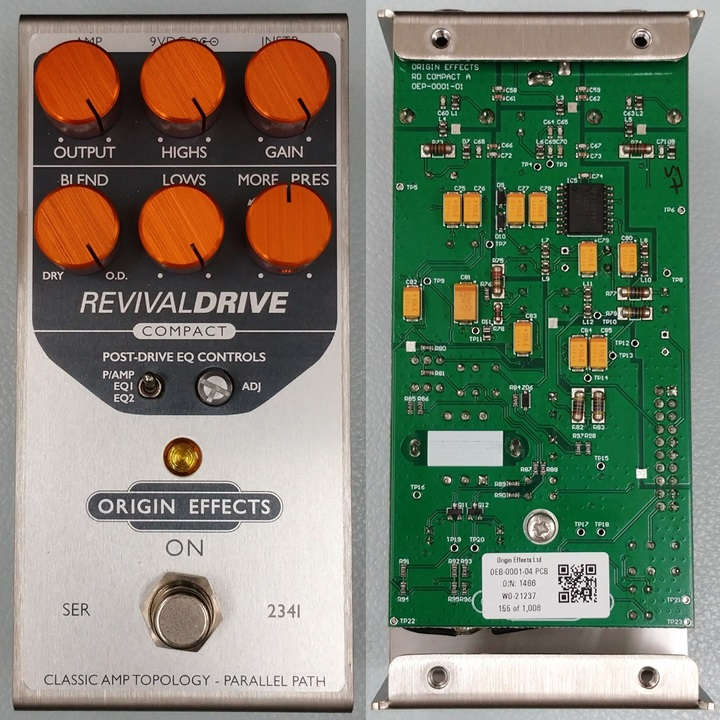 

[ORIGIN EFFECTS RevivalDRIVE](https://miyaji.co.jp/MID/product.php?item=Revival%20DRIVE%20Compact)は、真空管アンプの音を再現したペダルです。おそらく今までにない回路が使われているのだろうと考え、Compactバージョンを解析してみることにしました。

※ [X](https://x.com/kanengomibako)にていただいたコメント、情報提供についても参考にさせていただいております。誠にありがとうございます。

------

### 【基板】
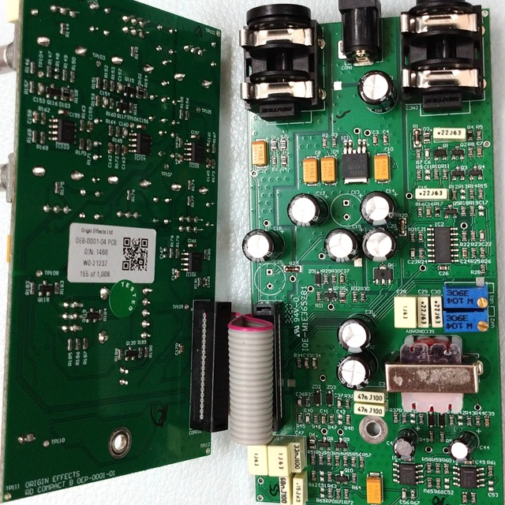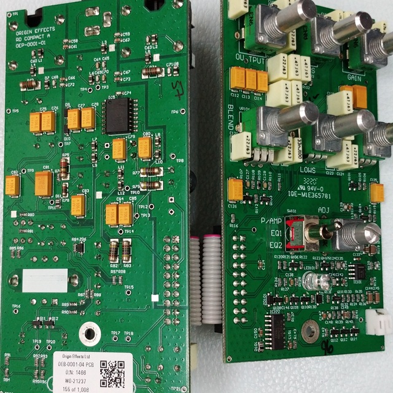 

4層基板が2枚という構成です。グラウンドがいくつかに分離されています。内層を見るには、基板を削るしかありません。実際削ってみると、内層は電源とグラウンド層だけで、隠れた配線はありませんでした。[KiCadデータ](https://github.com/kanengomibako/ReverseEngineering/tree/main/OriginEffects/RevivalDriveCompact/KiCad8)にはそれぞれの層の画像データを埋め込んであるため、かなり容量が大きくなっています。

### ▽回路図
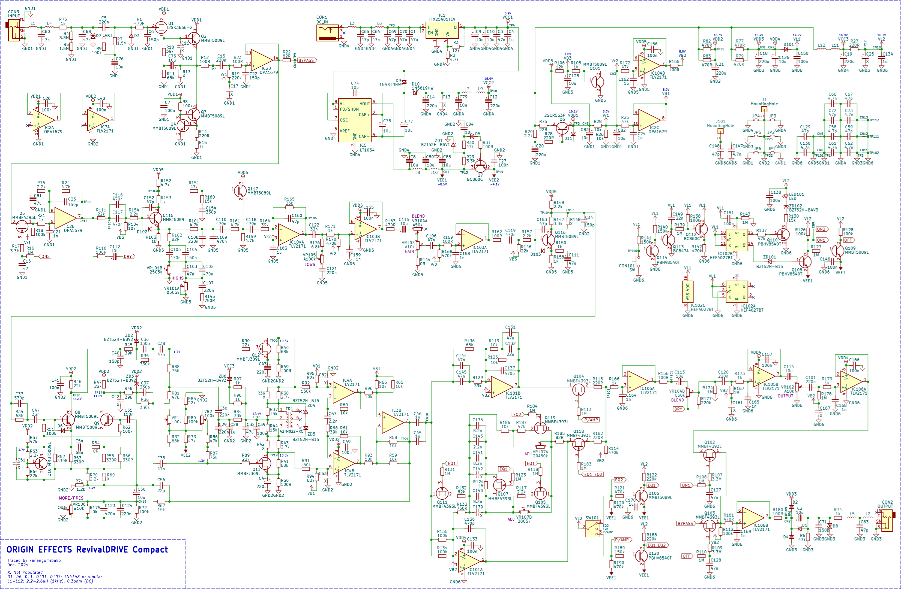 かなり部品数が多く、ポットには特殊な値のものが使われているため、クローンを作るのは難しいでしょう。目安として、実測した電圧を記載しています。

### 【電源】

高い電圧入力への対策のため、レギュレータが入っています。LT1054で負電圧が生成されていますが、オペアンプは正負電源ではなく単電源駆動です。真空管アンプのような電圧降下（サグ）も再現してあるらしいですが、回路からはそのような特性を読み取ることはできそうにありません。

- LT1054

  倍電圧を生成する場合、C77がCAP+ピンに接続されることが多いですが、CAP-ピンでも問題ないようです。C74（10pF）の役割はデータシートに記載があり、発振周波数が25kHzから45kHzに上がります。発振周波数が最悪の15kHzの個体でも、可聴域内のノイズを避けることができます。

- 正電源部フィルタ（Q6）

  通常のトランジスタのリプルフィルタでは見られない抵抗R75とR78が挿入されています。これらの抵抗は定格の大きなものが採用されており、大電流からの保護の目的があると考えられます。タンタルコンデンサの故障等による電源の短絡に備えてあるのかもしれません。

- 負電源部フィルタ（Q7）

  JFET増幅部（Q11・Q12）用の負のバイアス電圧が生成されています。ダイオード（D5）が挿入されていますが、役割は不明です。

### 【入力バッファ】

BOSSのバッファ（下図）に似ており、JFETのソースに定電流回路があります。RevivalDrive CompactではさらにトランジスタQ2が追加されている上、オペアンプのバッファもあります。
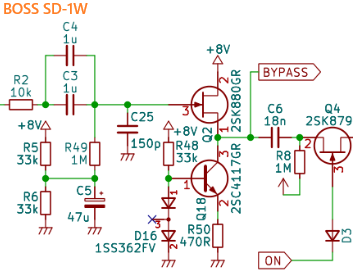 

### 【プリアンプ】

主な増幅は、トランジスタQ115とQ116のエミッタ接地回路です。

- バイアス電圧

  バイアス電圧は他の部分より低く（1.8V）、トランジスタ（Q101）が使われています。抵抗を使った場合とシミュレーション比較をしましたが、電圧の揺れ方の差はわずか（0.1mV程度）でした。

- HIGHS

  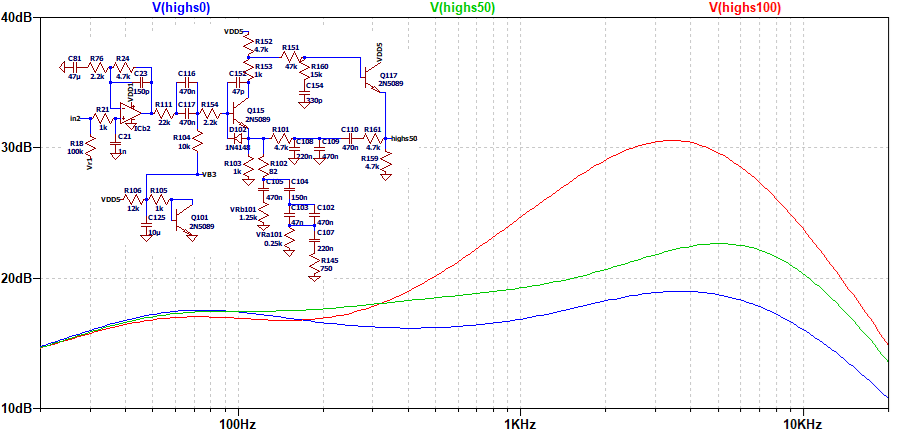 
  一般的なパッシブのトーンスタック回路ではなく、トランジスタQ115のエミッタ抵抗を減らすことで高音域をブーストする仕組みとなっています。

  この部分は正帰還のようになっているのが特徴的で、単純化しシミュレーションしました。

  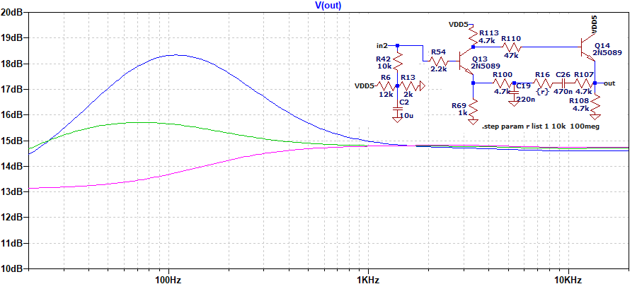 

  帰還があることにより低音域の増幅がみられます。同様の回路の真空管アンプは見つけられず、よく使われている回路というわけではなさそうです。

- LOWS

  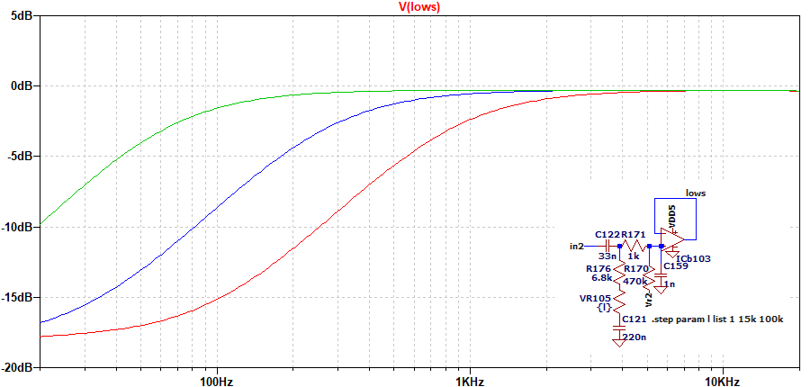 ハイパスフィルタにより、低音域が減少します。

### 【位相反転段・パワーアンプ】
真空管アンプの位相反転段（差動増幅）とプッシュプル回路の部分を模していると思われます。トランジスタ・JFETによる歪みだけでなく、ツェナーダイオード（ZD2・ZD3）でもクリッピングが起こるようです。

- バイアス設定

  トリマー（VR1・VR2）によりJFET（Q11・Q12）のゲート電圧が設定されます。テストポイントはドレインにあるので、ドレインでの電圧や出力振幅がQ11とQ12で同じになるように調整されている可能性があります。ゲートからはC29・C30を介してトランスの電源へと接続されていますが、何らかのフィードバックがあるのか、意図はわかりません。

- MORE/PRES

  真空管アンプのPRESENCEのように、負帰還を制限することにより高音域が増幅されます。

  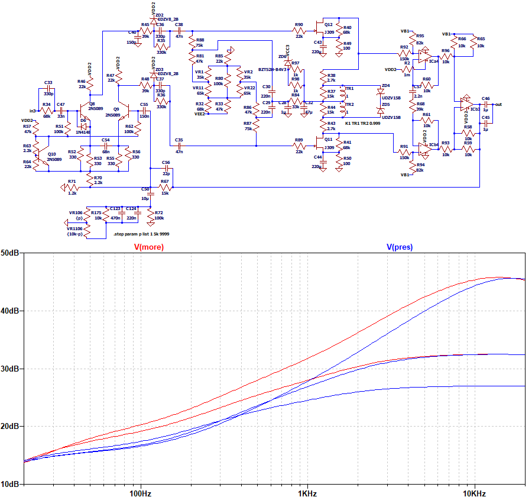 50%で最も増幅が少なくなります。PRES側よりMORE側（反時計周り）の方が幅広い帯域を増幅しています。

- 周波数特性（MORE/PRES：50%）

  いくつかのコンデンサやトランスを変更した場合に、周波数特性がどうなるかシミュレーションしました。トランスは、[LCRメータでトランスモデルを作る](http://daisan-y.private.coocan.jp/homepage2/html/20170914.html)というページを参考に実測しパラメータ設定しました。

  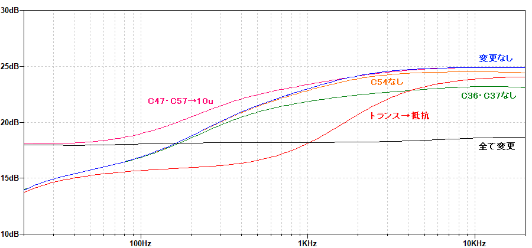 

  コンデンサによる低音域・高音域の変化がありますが、特にトランスによる中音域の変化が大きくなっています。

### 【POST-DRIVE EQ】
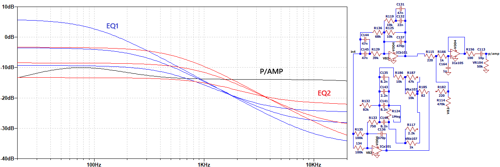 EQ1はフェンダーアンプ向け、EQ2はマーシャルアンプ向けとされています。EQ1の方がハイカットが大きいです。時計周りに回すと、低音域側が大きくなっていきます。P/AMPの時も、少し低音域の増幅があります。
